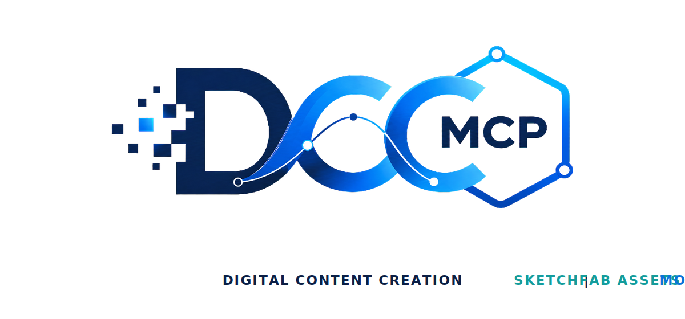
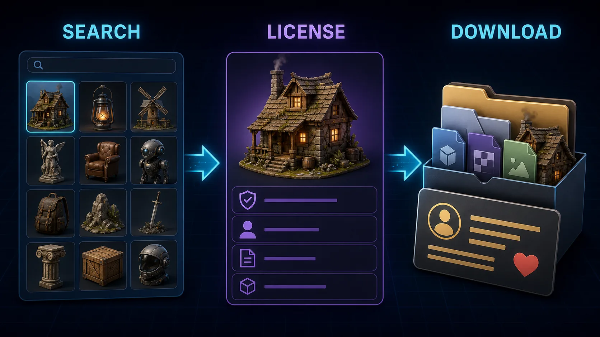

# DCC-MCP Sketchfab Assets

<p align="center">
  
</p>

## Agent workflow

AI agents should use installed package skills through the shared gateway. IDE
users may continue to use the MCP endpoint.

```bash
dcc-mcp-cli dcc-types
dcc-mcp-cli list
dcc-mcp-cli search --query "<task>" --dcc-type <host>
dcc-mcp-cli describe <tool-slug>
dcc-mcp-cli call <tool-slug> --json '{"key":"value"}'
```

If the package skill is not active, call
`dcc-mcp-cli load-skill <skill-name> --dcc-type <host>`. After the task,
query `dcc-mcp-cli stats --range 24h --session-id <task-id>` and pass only
bounded evidence to the `review_skill_improvement` prompt from
`dcc-mcp-skills-creator`.




Sketchfab free/downloadable model search and download tools for DCC-MCP.

This skill uses Sketchfab's official Data and Download APIs. It does not import
files into a DCC scene.

## Install

```bash
dcc-mcp-cli marketplace add dcc-mcp/dcc-asset-sketchfab
dcc-mcp-cli marketplace install dcc-asset-sketchfab
```

## Requirements

- Search uses the public API.
- Download requires a Sketchfab OAuth access token in `SKETCHFAB_TOKEN`.

## Tools

- `search_sketchfab_models`
- `get_sketchfab_model`
- `download_sketchfab_model`

## License Notes

This wrapper is MIT licensed. Sketchfab model licenses vary. Downloaded models
must keep their Creative Commons license, author attribution, and source link
where required by Sketchfab's API guidelines.
